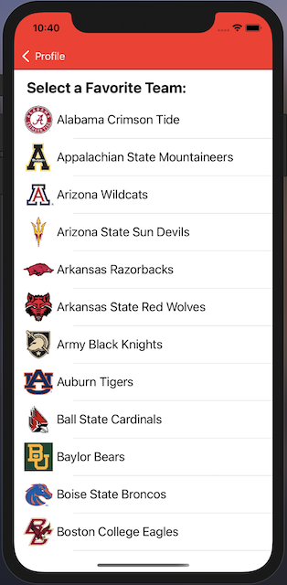

# HotTakes
College football-based iOS app where users follow their favorite CFB program and interact with others inside and outside the team's community. 
I began this app as part of an iOS programming course and have continued development since. My goal for this project is to create an all-in-one hub for CFB fanbases
to follow their team and discuss games, recruiting, etc. with each other.
Writing a full-stack app like this has boosted my interest and accelerated my learning in mobile software development.

#### Technologies Used:
* Swift
* Objective-C
* UIKit
* Google Firebase
* URLSession
* CollegeFootballData API (https://collegefootballdata.com)

#### Features:
HotTakes uses Google Firebase to provide authentication. Upon launch, you must sign in with a Google account.
\
\

\
\
After signing in, you are prompted to create your profile (left) by creating a username, selecting a favorite team (middle), and optionally uploading a profile picture. 
Once complete, you are brought to view your new profile (right). 
The app's theme uses the colors of your selected team, hence the navigation and tab bars are maroon for Boston College.
\
\

&nbsp;&nbsp;&nbsp;&nbsp;&nbsp;

&nbsp;&nbsp;&nbsp;&nbsp;&nbsp;

\
\
To check the scores, stats, and schedule of your favorite team, navigate to the first tab. 
Here, a list of all games and scores for the current season will be displayed (left).
By tapping on an individual game, you will be brought to another screen showing more detailed stats (right).
The team with the better stat in each category (i.e. more passing yards) is bolded.
\
\

&nbsp;&nbsp;&nbsp;&nbsp;&nbsp;

\
\
To interact with other users, navigate to the middle tab. 
Here, you will see the most recent posts by users you follow (left).
Press "Team" on the segmented control to view the most recent posts within your school community (right).
You can return back to viewing your followed users' posts by pressing "Following".
\
\

&nbsp;&nbsp;&nbsp;&nbsp;&nbsp;

\
\
You can visit other users' profiles by tapping on their post.
On their profile, you can view their picture in greater detail and see how long they've been a fan for.
You can also follow/unfollow them and view the list of users they follow and users who follow them.
\
\

&nbsp;&nbsp;&nbsp;&nbsp;&nbsp;

#### Features In Progress / Future Ideas:
* Direct Messaging
* Like/repost posts
* Display user posts on profile
* Enhanced posting interface
